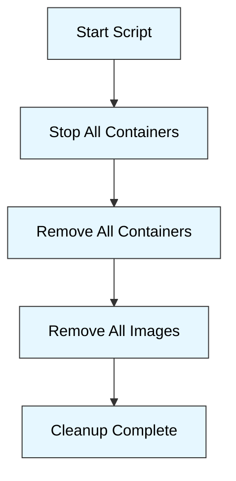

# 🐳 Docker Cleanup Script

## 📄 Documentation
This is a simple bash script to clean up your Docker environment by removing all containers and images. It's useful for freeing up disk space and starting fresh with Docker.

### dcleanup
This script performs the following operations:
- Stops all running Docker containers
- Removes all Docker containers (running or stopped)
- Removes all Docker images

## 📋 Usage
1. Make the script executable:
   ```bash
   chmod +x dcleanup
   ```

2. Optionally, move the script to a directory in your PATH for easy access:
   ```bash
   sudo mv dcleanup /usr/local/bin/
   ```

3. Run the script:
   ```bash
   dcleanup
   ```

## ⚠️ Warning
**CAUTION**: This script will remove ALL Docker containers and images from your system. 
This action cannot be undone. Make sure you have backups or can rebuild any important images 
before running this script.

## 🏗️ Architecture diagram

