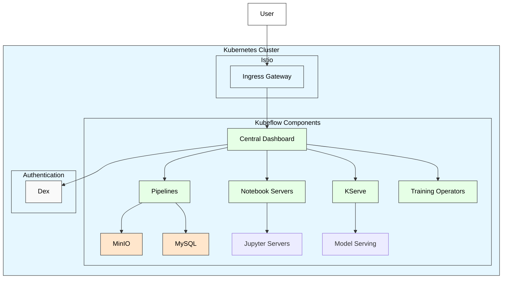

# 🚀 Kubeflow Setup Script

## 📄 Documentation
This directory contains a script for installing and configuring Kubeflow on a Kubernetes cluster. Kubeflow is a machine learning toolkit for Kubernetes that makes deploying ML workflows on Kubernetes simple, portable, and scalable.

### kubeflow-setup.sh
This script automates the installation of Kubeflow on a Kubernetes cluster. It performs the following tasks:
- Installs Kustomize, a tool for customizing Kubernetes configurations
- Clones the official Kubeflow manifests repository
- Checks out a specific version (v1.10.0) of the manifests
- Applies the Kubeflow resources to the Kubernetes cluster using Kustomize
- Configures the Istio ingress gateway for Tailscale exposure

## 📋 Prerequisites
- A running Kubernetes cluster
- `kubectl` configured to communicate with your cluster
- Git installed
- Sudo privileges (for copying kustomize to /usr/bin)
- Internet access to download required components

## 📋 Usage
1. Make the script executable:
   ```bash
   chmod +x kubeflow-setup.sh
   ```

2. Run the script:
   ```bash
   ./kubeflow-setup.sh
   ```

3. Wait for the installation to complete. This may take several minutes as it deploys multiple components.

## 🔍 Accessing Kubeflow
After installation, Kubeflow can be accessed through the Istio ingress gateway. If you're using Tailscale (as configured in the script), you can access it through your Tailscale network.

The default URL will be:
```
http://<cluster-ip>/
```

## 🏗️ Architecture diagram


## ⚠️ Notes
- The installation process may take some time to complete as it deploys multiple components.
- The script uses the `--server-side` and `--force-conflicts` flags with kubectl to handle potential conflicts during installation.
- The script annotates the Istio ingress gateway for Tailscale exposure, which assumes you have Tailscale configured in your cluster.

## 📚 Additional Resources
- [Kubeflow Official Documentation](https://www.kubeflow.org/docs/)
- [Kubeflow GitHub Repository](https://github.com/kubeflow/kubeflow)
- [Kustomize Documentation](https://kubectl.docs.kubernetes.io/guides/introduction/kustomize/)
