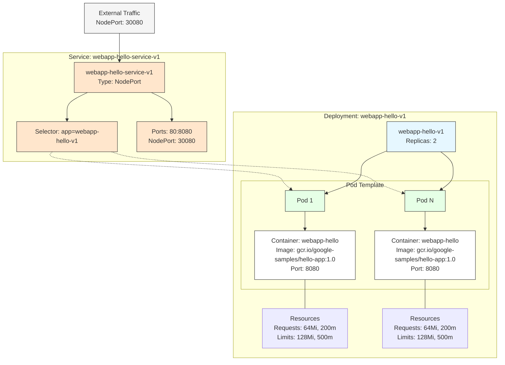

```mermaid
flowchart TD
    %% External traffic at the top
    extTraffic[External Traffic\nNodePort: 30080] --> svc
    
    %% Service at the top
    subgraph "Service: webapp-hello-service-v1"
        svc[webapp-hello-service-v1\nType: NodePort] --> sel[Selector: app=webapp-hello-v1]
        svc --> portMap[Ports: 80:8080\nNodePort: 30080]
    end
    
    %% Connection between Service and Pods
    sel -.-> pod1
    sel -.-> podN
    
    subgraph "Deployment: webapp-hello-v1"
        direction TB
        dep[webapp-hello-v1\nReplicas: 2] --> pod1[Pod 1]
        dep --> podN[Pod N]
        
        subgraph "Pod Template"
            pod1 --> cont1[Container: webapp-hello\nImage: gcr.io/google-samples/hello-app:1.0\nPort: 8080]
            podN --> contN[Container: webapp-hello\nImage: gcr.io/google-samples/hello-app:1.0\nPort: 8080]
        end
        
        classDef resources fill:#ffffff,stroke:#333,stroke-width:1px
        class cont1,contN resources
        
        %% Resources
        cont1 --- res1[Resources\nRequests: 64Mi, 200m\nLimits: 128Mi, 500m]
        contN --- resN[Resources\nRequests: 64Mi, 200m\nLimits: 128Mi, 500m]
    end
    
    classDef deployment fill:#e6f7ff,stroke:#333,stroke-width:1px
    classDef service fill:#ffe6cc,stroke:#333,stroke-width:1px
    classDef pod fill:#e6ffe6,stroke:#333,stroke-width:1px
    classDef traffic fill:#f5f5f5,stroke:#333,stroke-width:1px
    
    class dep deployment
    class svc,sel,portMap service
    class pod1,podN pod
    class extTraffic traffic
```