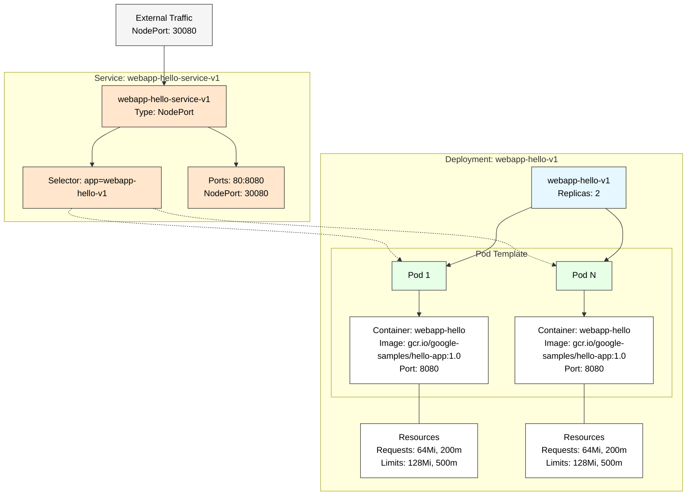

# Basic Kubernetes Deployment

## Documentation
Creates 6 pods with 1 service attached as NodePort. Ideally for local testing purposes. 

### 1-webapp-hello-v1.yaml
It does the nginx pod deployment.

### 2-webapp-hello-service-v1.yaml
It does the service nodport deployment.

## Architecture diagram
Creates 6 pods with 1 service attached as NodePort.

