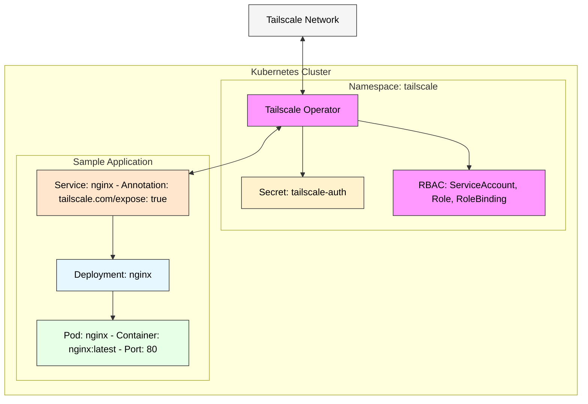

# 🔐 Tailscale Operator for Kubernetes

## 📄 Documentation
This directory contains Kubernetes configurations for deploying and configuring the Tailscale Operator in a Kubernetes cluster. The Tailscale Operator allows you to expose Kubernetes services to your Tailscale network, enabling secure access without exposing them to the public internet.

### steps.sh
Contains the Helm commands to install and configure the Tailscale Operator in your Kubernetes cluster.

### app-operator.yml
Defines a sample Nginx deployment and service with the Tailscale annotation `tailscale.com/expose: "true"` that makes the service accessible via Tailscale.

### tailscale-rbac..yml
Contains the necessary RBAC configurations for Tailscale:
- ServiceAccount: Creates a service account for Tailscale
- Role: Defines permissions to access and update the Tailscale authentication secret
- RoleBinding: Binds the role to the service account

### tailscale-secret.yml
Contains a Kubernetes secret with the Tailscale authentication key used to authenticate with the Tailscale network.

## 📋 Usage
Follow these steps to deploy the Tailscale Operator:

1. Set up new Tailscale ACL policy rules to get started:
```json
{
  "tagOwners": {
    "tag:k8s-operator": [],
    "tag:k8s": ["tag:k8s-operator"]
  }
}
```

2. Create an OAuth client for the operator:
   - Navigate to the Tailscale admin console's Settings > OAuth clients page and click the Generate OAuth client
   - Give your OAuth client a name using the form's description field
   - Enable the Read and Write scopes for the Devices role
   - When the Write scope is expanded, a Tags field will appear
   - Select the tag:k8s-operator tag created earlier from the dropdown to ensure devices created by the operator will have the tag assigned

3. Create the Tailscale namespace and RBAC resources:
```bash
kubectl apply -f tailscale-rbac.yml
```

4. Create the Tailscale authentication secret (update with your actual Tailscale auth key):
```bash
kubectl apply -f tailscale-secret.yml
```

5. Install the Tailscale Operator using Helm as described in steps.sh:
```bash
helm repo add tailscale https://pkgs.tailscale.com/helmcharts
helm repo update
helm upgrade --install tailscale-operator tailscale/tailscale-operator \
  --namespace=tailscale \
  --create-namespace \
  --set-string oauth.clientId=<oauth_client_id> \
  --set-string oauth.clientSecret=<oauth_client_secret> \
  --wait
```

6. Deploy a sample application with Tailscale exposure:
```bash
kubectl apply -f app-operator.yml
```

After deployment, the Nginx service will be accessible via your Tailscale network.

## 🏗️ Architecture diagram


## 📚 References
- [Managing Access to Kubernetes with Tailscale](https://tailscale.com/learn/managing-access-to-kubernetes-with-tailscale#deploy-tailscale-in-your-kubernetes-cluster)
